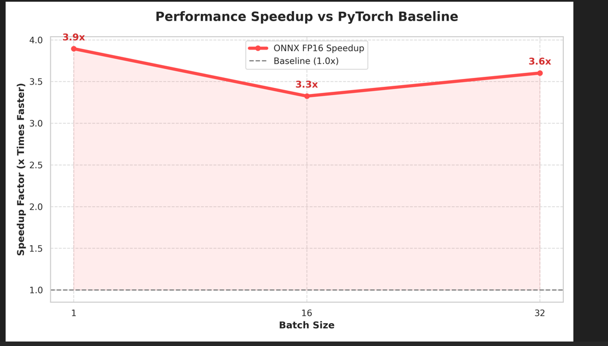
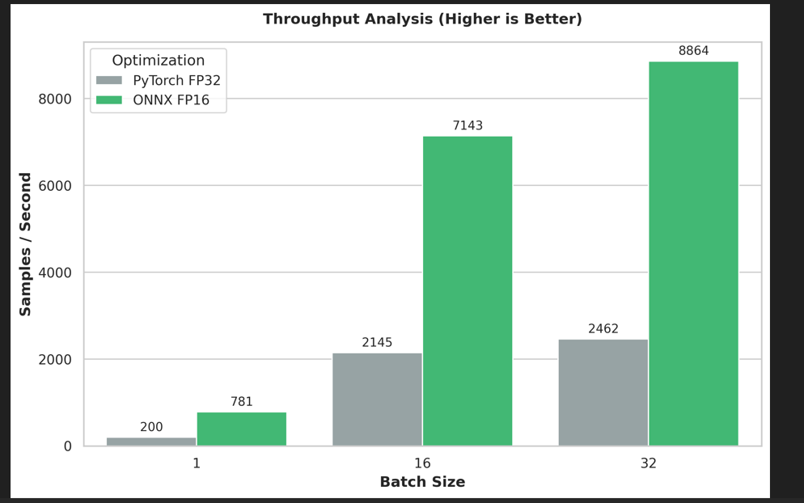
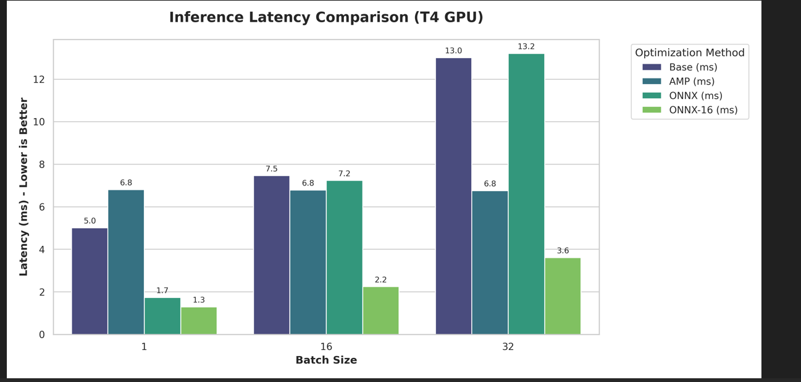
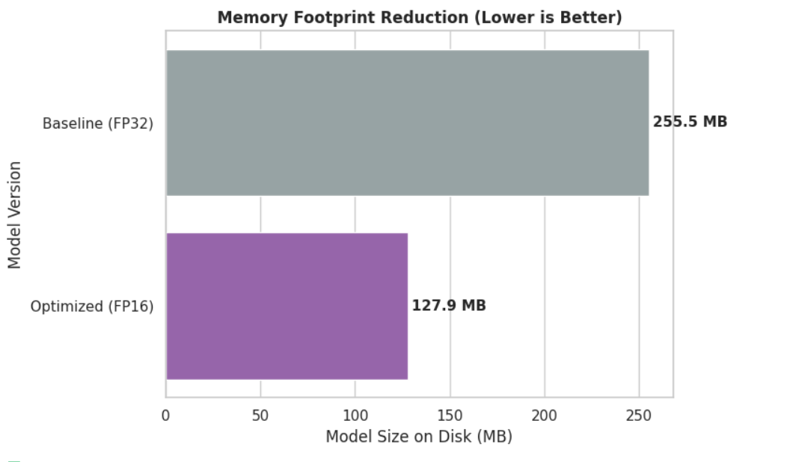
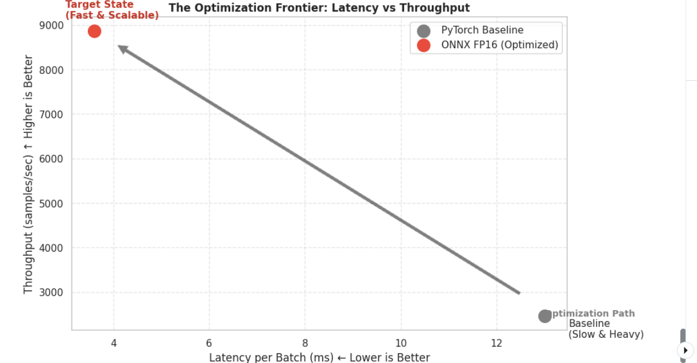

# High-Performance Transformer Inference Engine

**Optimization of DistilBERT inference on NVIDIA T4, achieving 3.9x speedup and 50% memory reduction via ONNX Runtime and FP16 Quantization.**

## 1. Executive Summary
This project implements a production-grade inference pipeline for Transformer models, addressing the high latency and memory overhead of standard PyTorch execution. By leveraging **ONNX Runtime (ORT)** with **CUDA Execution Provider** and **Mixed Precision (FP16)**, the system maximizes GPU throughput while maintaining model accuracy.

**Technical Highlights:**
* **Latency Reduction:** Decreased single-batch latency from **5.00ms** to **1.28ms** (**3.9x** improvement).
* **Throughput Scalability:** Scaled processing capability to **~9,000 requests/second** at Batch 32.
* **Memory Efficiency:** Reduced VRAM footprint by **50%** (255MB $\to$ 127MB) via dynamic quantization.
* **Architecture Stability:** Resolved PyTorch 2.x Opset 12 export conflicts using custom `SDPBackend` context management.

## 2. Performance Benchmarks (NVIDIA Tesla T4)

| Batch Size | PyTorch (FP32) | ONNX (FP16) | Speedup Factor | Throughput (Req/s) |
| :--- | :--- | :--- | :--- | :--- |
| **1** | 5.00 ms | 1.28 ms | **3.90x** | 781 |
| **16** | 7.46 ms | 2.24 ms | **3.33x** | 7,142 |
| **32** | 13.00 ms | 3.61 ms | **3.60x** | 8,864 |

## 3. Visualization

### Performance Speedup


### Throughput Scaling


### Latency Comparison


### Memory Footprint


### Efficiency Frontier (Latency vs. Throughput)


## 4. Technical Stack
* **Model Architecture:** DistilBERT (Hugging Face Transformers)
* **Inference Engine:** ONNX Runtime (GPU)
* **Optimization Techniques:**
    * Graph Optimization (Level 3 - ORT_ENABLE_ALL)
    * FP16 Mixed Precision
    * Operator Fusion
* **Development Environment:** PyTorch 2.0+, CUDA 11.x

## 5. Usage Implementation
```python
from transformer_toolkit import TransformerOptimizationToolkit

# 1. Initialize the Optimization Engine
toolkit = TransformerOptimizationToolkit("distilbert-base-uncased")

# 2. Export Model to ONNX (with Opset 12 Compatibility)
toolkit.export_onnx(dummy_input)

# 3. Execute Performance Analysis
metrics = toolkit.run_full_analysis(text_input, batch_sizes=[1, 16, 32])
print(metrics)
```
